Báo cáo đồ án cá nhân trí tuệ nhân tạo
Đề tài: Giải bài toán đặt 8 quân xe lên bàn cờ với điều kiện chúng không ăn lẫn nhau bằng các thuật toán tìm kiếm

Giảng viên hướng dẫn: Phan Thị Huyền Trang 

Sinh viên thực hiện: Huỳnh Gia Định
Mã sinh viên: 23110092
1. Mục Tiêu
Mục tiêu của đề tài:
- Sử dụng các thuật toán tìm kiếm để tìm ra trạng thái các quân xe không ăn nhau trùng với trạng thái đích cho trước
- Thể hiện trực quan lên giao diện để người dùng hiểu đc cách hoạt động
2. Nội dung thực hiện

  2.1. Mô tả bài toán
  - Trạng thái ban đầu (Initial State): Bàn cờ 8x8 rỗng, gồm 64 ô được đánh số theo hàng và cột.
  - Trạng thái mục tiêu (Goal State): 8 quân xe được đặt trên bàn sao cho không quân nào đứng cùng hàng hoặc cùng cột – đảm bảo điều kiện “không ăn nhau”.
  - Tập hành động (Actions): Lần lượt đặt từng quân xe lên bàn theo quy tắc xác định vị trí hợp lệ.
  - Không gian trạng thái (State Space): Tất cả các trạng thái có thể sinh ra trong quá trình đặt quân.
  - Lời giải (Solution): Một ma trận 8x8 biểu diễn vị trí của 8 quân xe thỏa mãn điều kiện bài toán.

  2.2. Nhóm thuật toán tìm kiếm không có thông tin (Uninformed Search):

  Nhóm này bao gồm các thuật toán không sử dụng thông tin bổ sung về trạng thái đích mà chỉ dựa trên cấu trúc tìm kiếm. Các thuật toán được cài đặt gồm:
DFS, BFS, UCS, DLS, IDS.
    
    2.2.1. DFS(Depth-First Search):
  
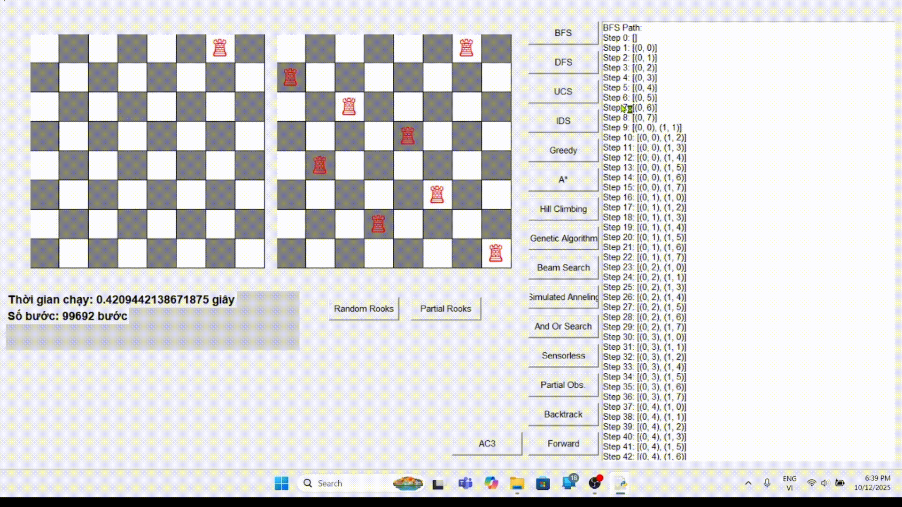

    Sử dụng ngăn xếp (Stack) để lưu trữ các trạng thái, thuật toán sẽ mở rộng nhánh sâu nhất trước khi quay lại.
    Ưu điểm: Tiết kiệm bộ nhớ, có thể tìm lời giải nhanh nếu đích ở độ sâu nhỏ.
    Nhược điểm: Dễ rơi vào vòng lặp vô hạn.

    
  
    2.2.2. BFS (Breadth-First Search):
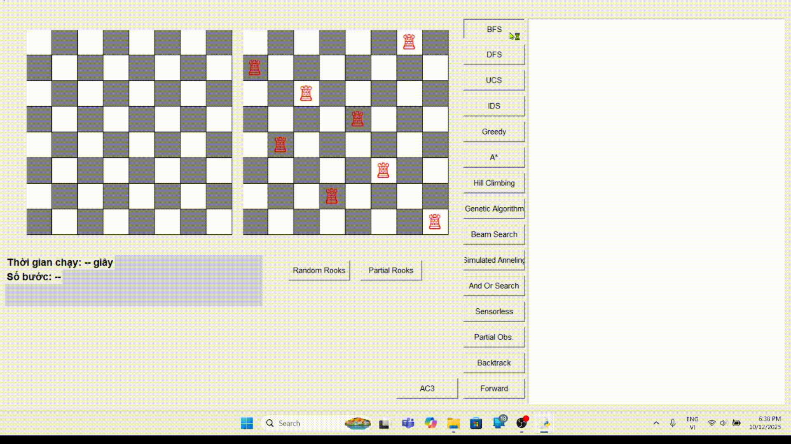

  
    Dựa trên hàng đợi (Queue), BFS mở rộng tất cả các nút ở cùng một mức trước khi sang mức kế tiếp.
    Ưu điểm: Đảm bảo tìm được lời giải nếu có, và lời giải là ngắn nhất.
    Nhược điểm: Tiêu tốn bộ nhớ lớn do phải lưu tất cả các nút trong cùng một tầng.

    2.2.3. UCS (Uniform Cost Search):

    Sử dụng hàng đợi ưu tiên (Priority Queue) để chọn nút có chi phí thấp nhất để mở rộng.
    Ưu điểm: Đảm bảo tìm được đường đi có tổng chi phí nhỏ nhất.
    Nhược điểm: Thời gian và bộ nhớ tiêu tốn lớn nếu có nhiều trạng thái có chi phí tương đương.
  
    2.2.4. DLS (Depth Limit Search)
    
  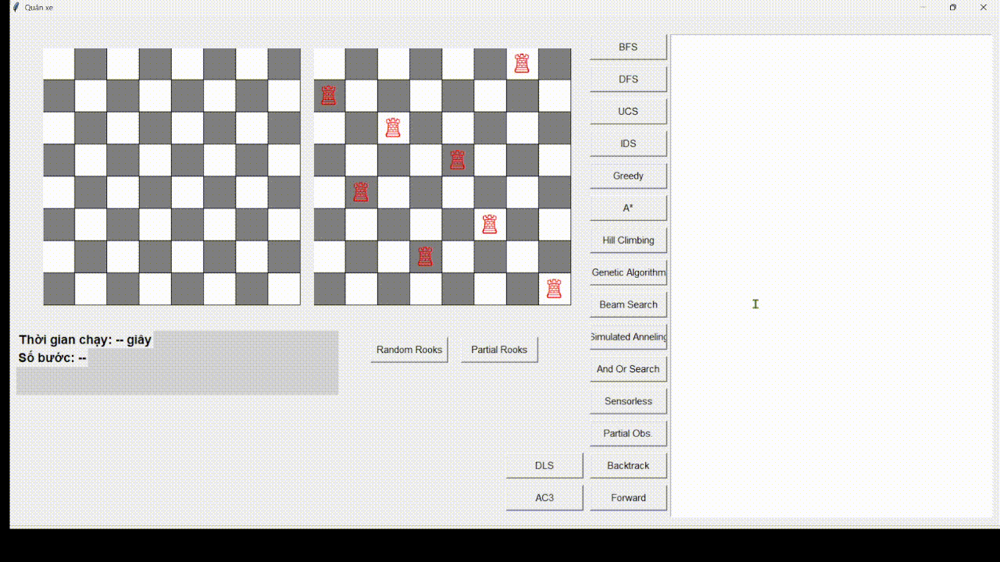

    Sử dụng thuật toán DFS để tìm kiếm nhưng có giới hạn độ sâu
    Ưu điểm: Tránh được vòng lặp vô hạn của DFS, giảm bớt không gian tìm kiếm.
    Nhược điểm: Không hoàn chỉnh nếu giới hạn nhỏ hơn độ sâu lời giải.
  
    2.2.5. IDS(Iterative Deepening Search)
  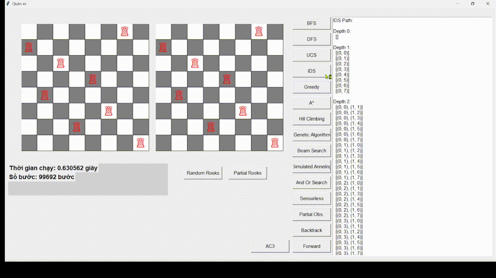

    Kết hợp ưu điểm của DFS và BFS, thuật toán lặp lại quá trình DLS với giới hạn độ sâu tăng dần (limit = 0, 1, 2, …).
    Ưu điểm: Tiết kiệm bộ nhớ như DFS nhưng đảm bảo tìm thấy lời giải.
    Nhược điểm: Tốn thời gian do phải lặp lại nhiều cấp độ.
  
    2.2.6 So sánh hiệu suất
    - Biểu đồ thời gian thực thi
    
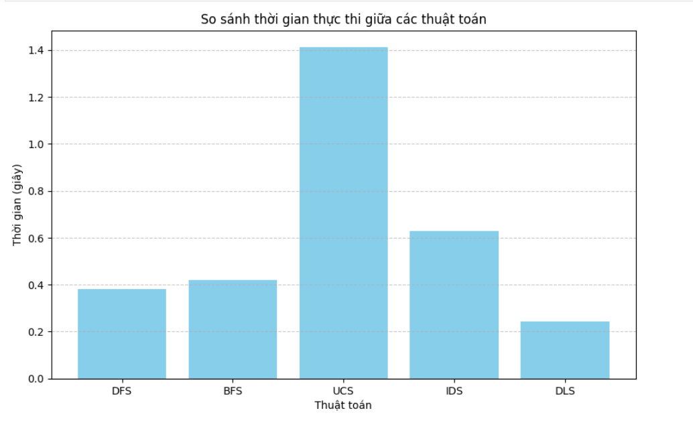
    - Biểu đò số bước tìm kiếm

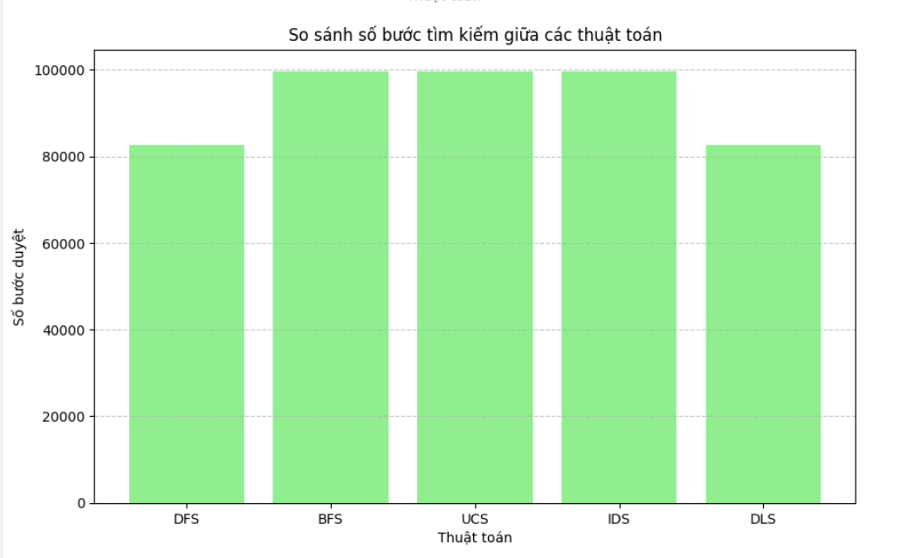
    
    
    - Biểu đồ tổng hợp hiệu quả: 1/(Step x Time)
 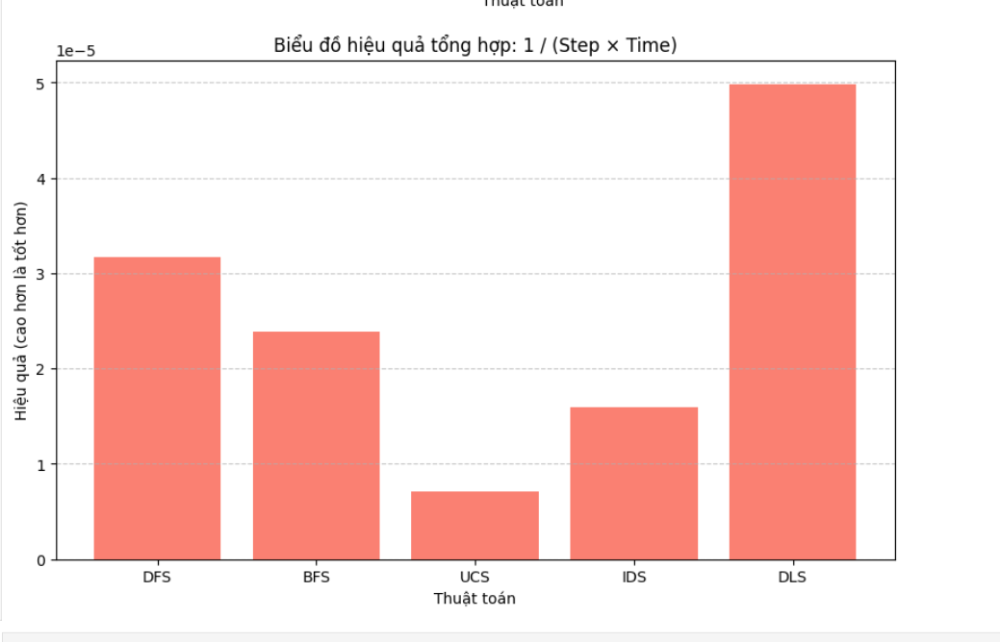

  2.3. Nhóm thuật toán tìm kiếm có thông tin
  
  Các thuật toán này sử dụng hàm heuristic để ước lượng khoảng cách hoặc chi phí từ trạng thái hiện tại đến trạng thái đích.
  
      2.3.1 Greedy Search
  

      Lựa chọn mở rộng trạng thái có giá trị heuristic tốt nhất.
      Ưu điểm: tìm được lời giải nhanh chóng
      Nhược điểm: hiệu suất thuật toán phụ thuộc nhiều vào các hàm tính toán chi phí
  
      2.3.2. A* Search
 
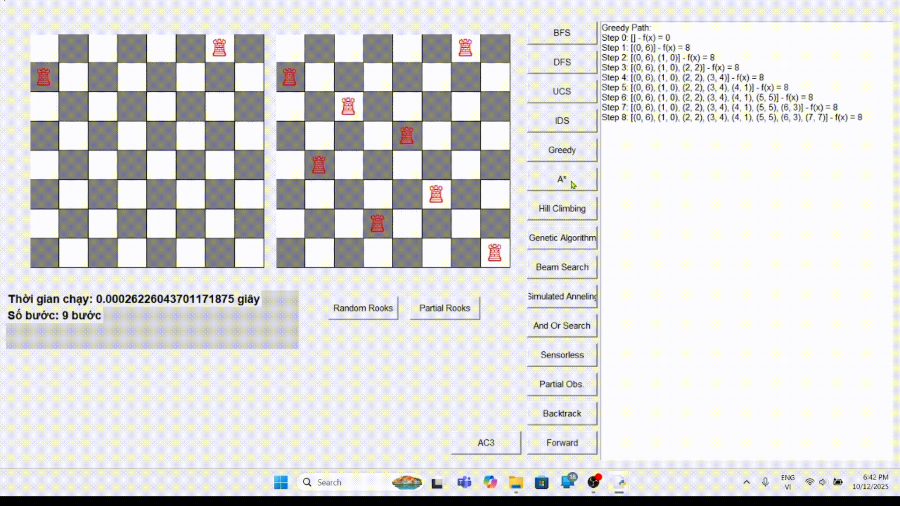

      Kết hợp chi phí thực tế g(n) và ước lượng h(n) theo công thức: f(n) = g(n) + h(n).
      Ưu điểm: Đảm bảo tính tối ưu và đầy đủ nếu h(n) là heuristic chấp nhận được.
      Nhược điểm: Tốn bộ nhớ và khó xác định hàm heuristic phù hợp.
  
      2.3.3 So sánh hiệu suất
  
    - Biểu đồ thời gian thực thi

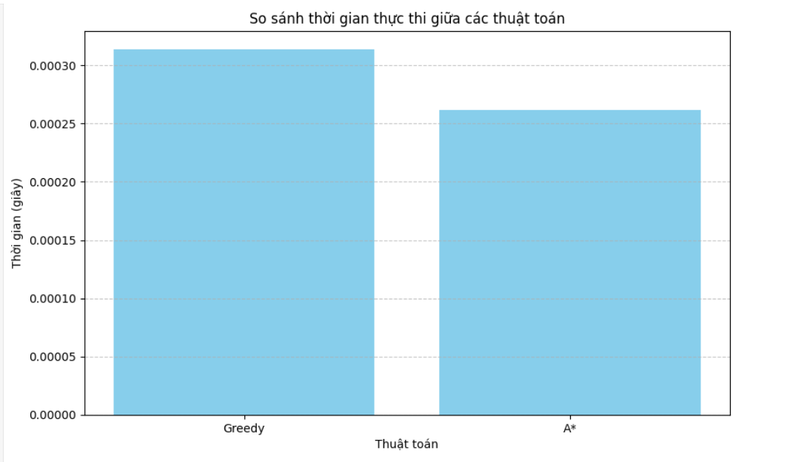

    
    - Biểu đò số bước tìm kiếm

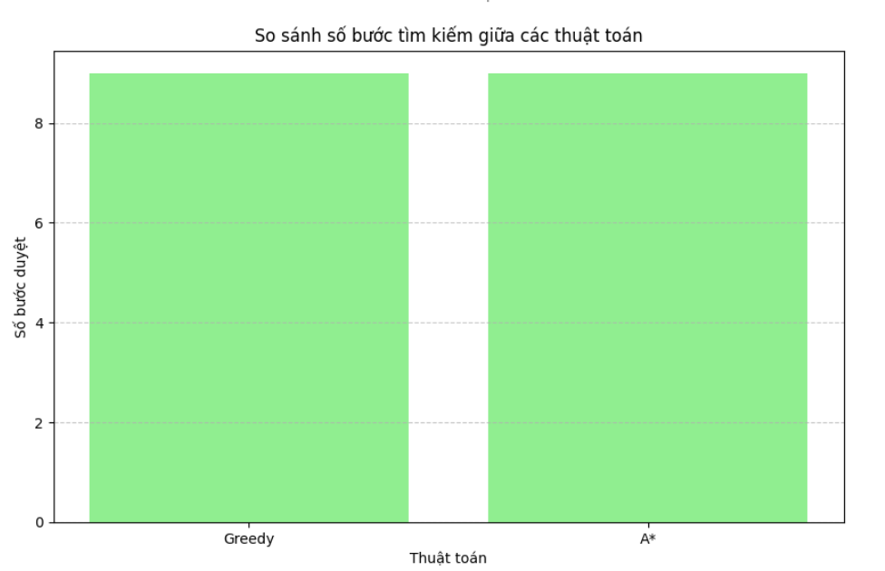

    - Biểu đồ tổng hợp hiệu quả: 1/(Step x Time)

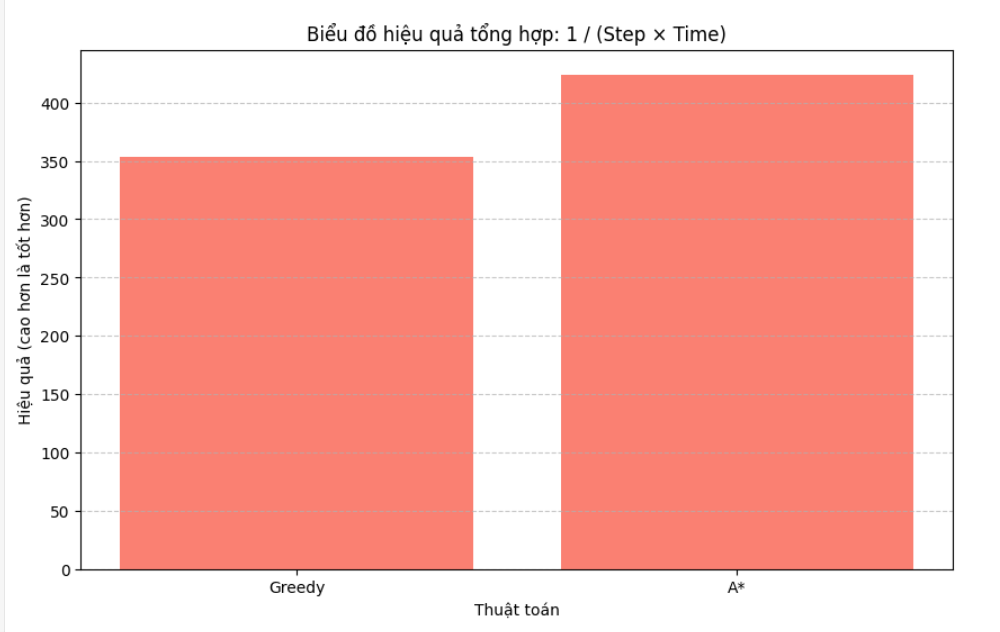

  
      
  2.4 Nhóm thuật toán tìm kiếm cục bộ (Local Search)

  
  Tập trung tìm kiếm trong một không gian trạng thái cố định, chỉ di chuyển sang trạng thái lân cận tốt hơn.
  
      2.4.1. Hill Climbing
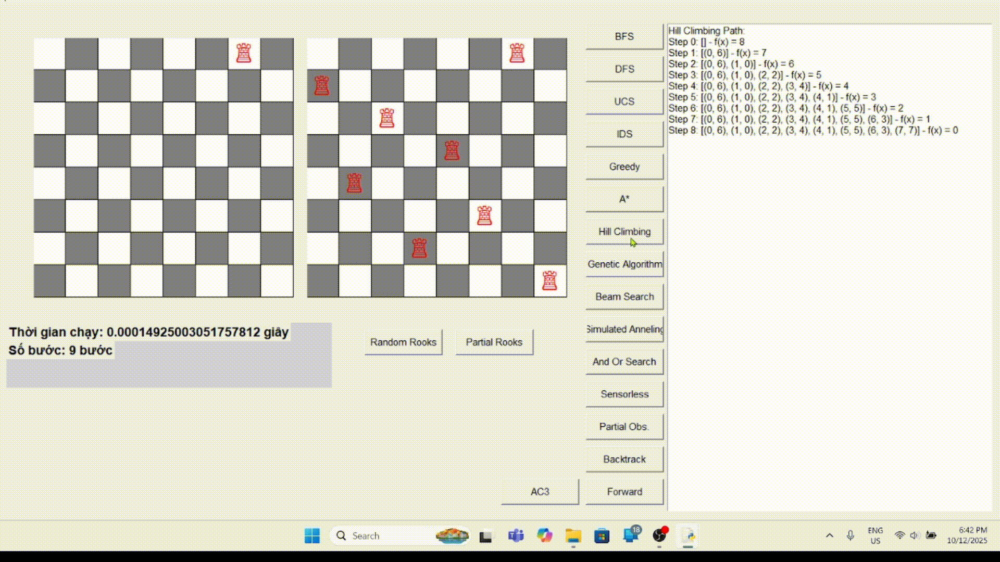

      Chọn trạng thái lân cận tốt nhất để tiến tới.
      Ưu điểm: Đơn giản, sử dụng ít bộ nhớ.
      Nhược điểm: Dễ dừng ở cực trị địa phương.
  
      2.4.2. Genetic Algorithm

 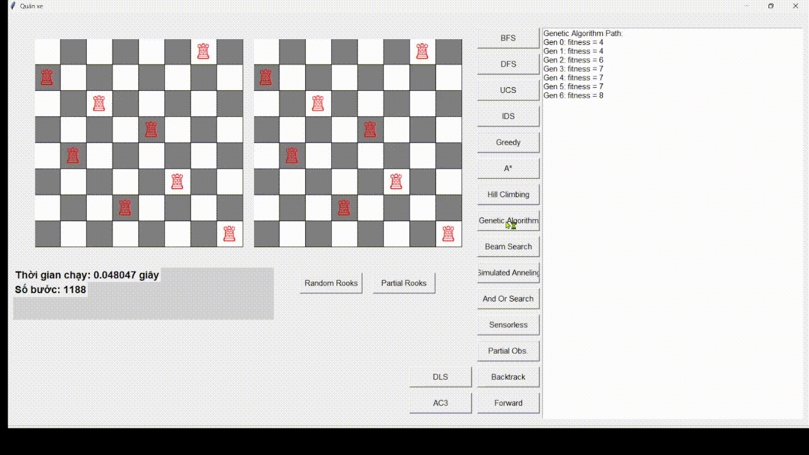

      Dựa trên các cơ chế chọn lọc – lai ghép – đột biến để tạo ra thế hệ trạng thái mới.
      Ưu điểm: Tìm kiếm hiệu quả trong không gian lớn.
      Nhược điểm: Thiết kế hàm thích nghi và các toán tử lai ghép phức tạp
  
      2.4.3. Simulated Annealing
  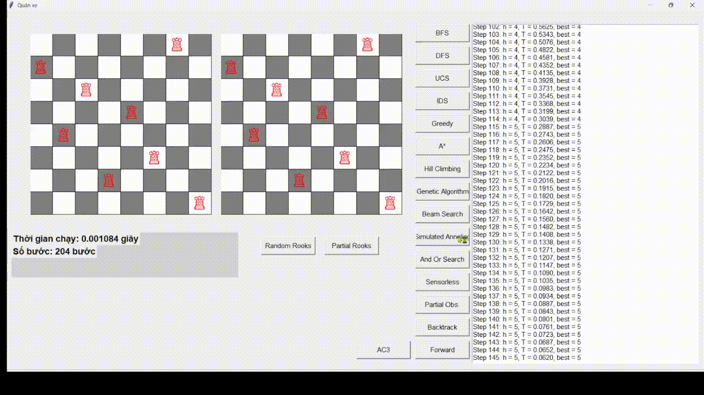

      Lấy cảm hứng từ quá trình nung chảy kim loại và làm nguội dần, cho phép di chuyển đến trạng thái xấu hơn với xác suất giảm dần theo thời gian.
      Ưu điểm: Có thể thoát khỏi cực trị địa phương.
      Nhược điểm: Cần chọn hàm xác suất và tốc độ giảm nhiệt độ hợp lý.
  
      2.4.4 Beam Search
  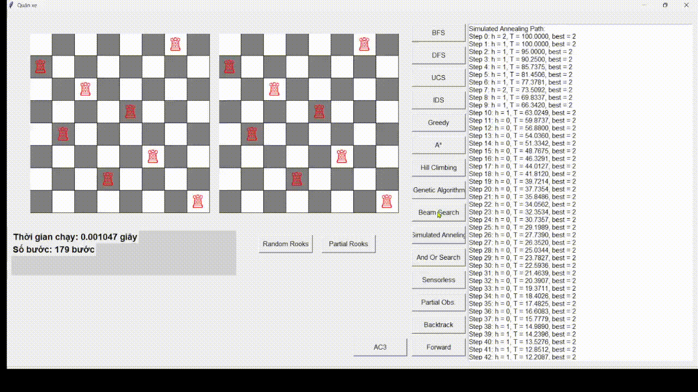

      Giữ lại K trạng thái tốt nhất ở mỗi mức thay vì toàn bộ như BFS.
      Ưu điểm: Giảm đáng kể bộ nhớ cần dùng.
      Nhược điểm: Có thể bỏ qua lời giải tối ưu.
  
      2.4.5. So sánh hiệu suất
  
      - Biểu đồ thời gian thực thi.

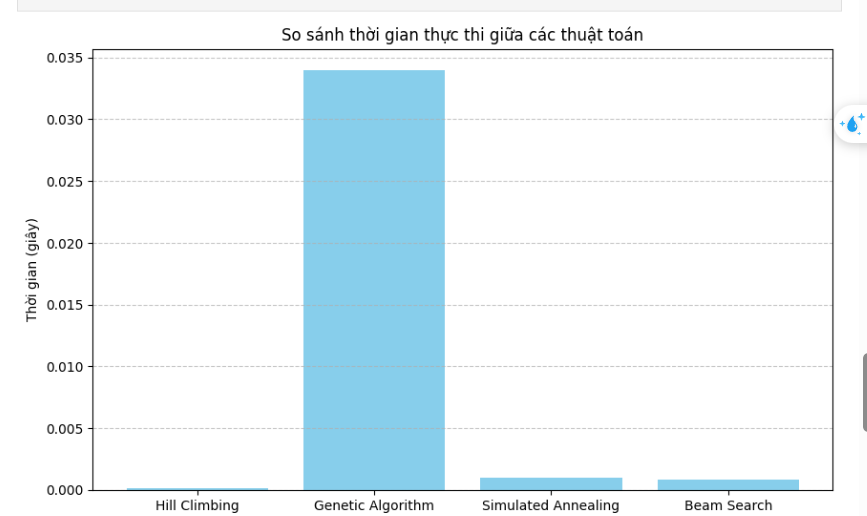

      - Biểu đồ số bước thực hiện.

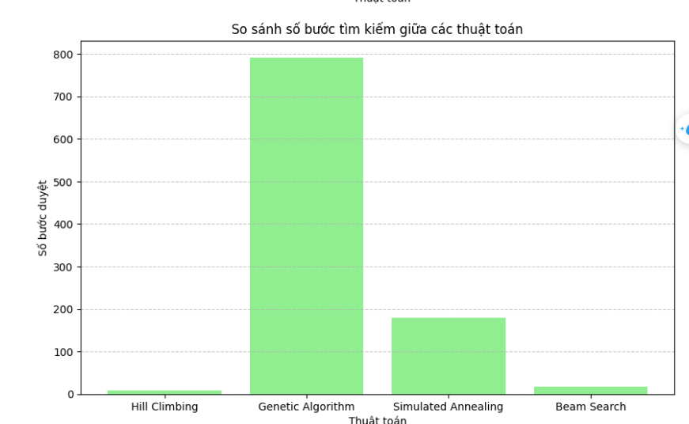

      - Biểu đồ hiệu quả 1/(Step × Time).

  
  2.5. Nhóm thuật toán tìm kiếm trong môi trường phức tạp (Complex Search)

  Nhóm này xử lý các bài toán trong môi trường không chắc chắn hoặc quan sát một
  
      2.5.1 AND-OR Search
  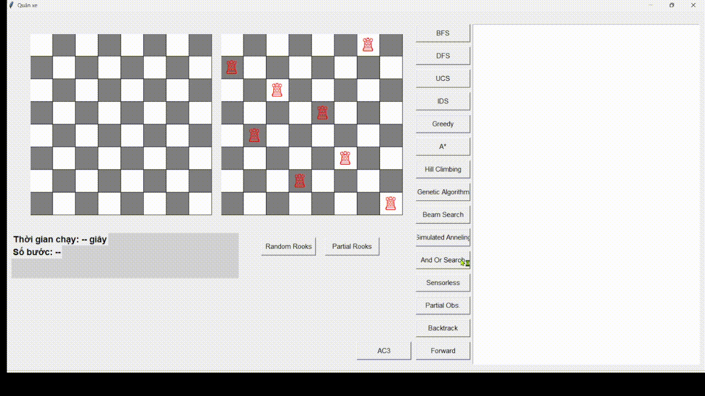

        Phân biệt giữa nút lựa chọn (OR) và nút bắt buộc (AND) trong quá trình tìm kiếm.
        Ưu điểm: Mô phỏng tốt các bài toán có điều kiện phức tạp.
        Nhược điểm: Không thích hợp với không gian tìm kiếm lớn.
  
      2.5.2 Belief State Search

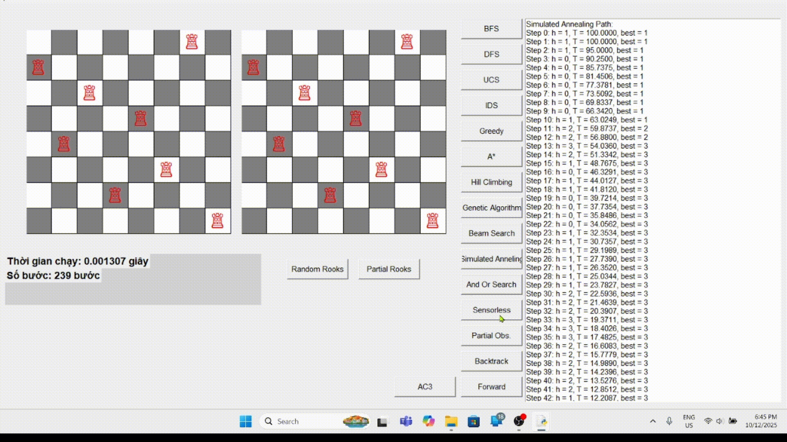

        Áp dụng khi không quan sát được trạng thái thật, chỉ biết tập hợp các khả năng có thể xảy ra.
        Ưu điểm: Giải quyết được bài toán trong môi trường không chắc chắn.
        Nhược điểm: Dễ bị rơi vào trạng thái suy luận sai hoặc cực trị địa phương.
  
      2.5.3. Partial Observation Search

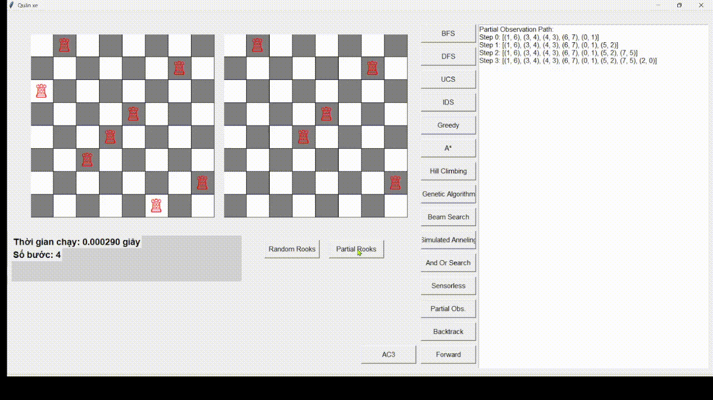

        Tìm kiếm dựa trên thông tin quan sát được một phần.
        Ưu điểm: Kết hợp giữa tìm kiếm và suy luận.
        Nhược điểm: Khó xác định trạng thái chính xác, dễ lặp hoặc sai hướng.
  
      2.5.4. So sánh hiệu suất
  
      - Biểu đồ thời gian thực thi.

      - Biểu đồ số bước thực hiện.

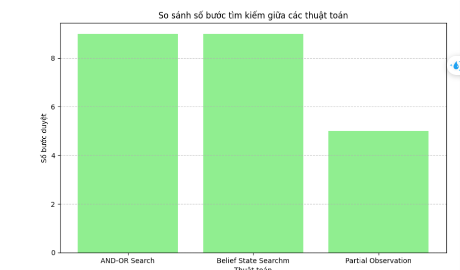

      - Biểu đồ hiệu quả theo công thức 1 / (Step × Time).

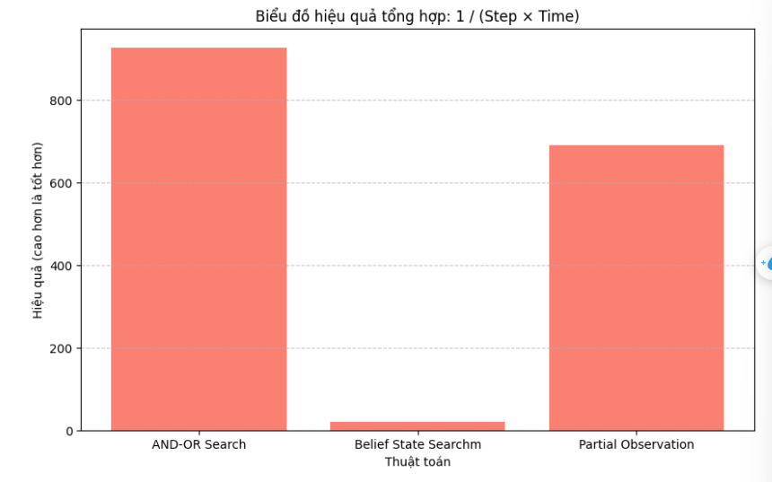

    
  2.6. Nhóm thuật toán tìm kiếm dựa trên ràng buộc

Những thuật toán này tìm kiếm lời giải thỏa mãn các ràng buộc nhất định, chẳng hạn trong bài toán 8 quân xe là điều kiện không hai xe nào cùng hàng hoặc cùng cột.
  
      2.6.1. Backtracking Search
  
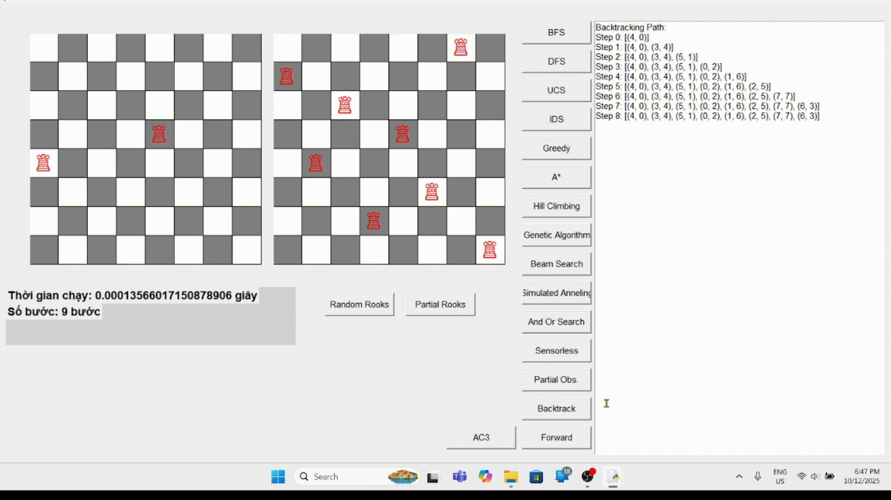

        Thực hiện tìm kiếm theo chiều sâu, quay lui khi gặp mâu thuẫn.
        Ưu điểm: Dễ hiểu, dễ triển khai, tiết kiệm bộ nhớ.
        Nhược điểm: Tốc độ chậm, không tận dụng được thông tin ràng buộc sớm.
  
      2.6.2. Forward Checking
  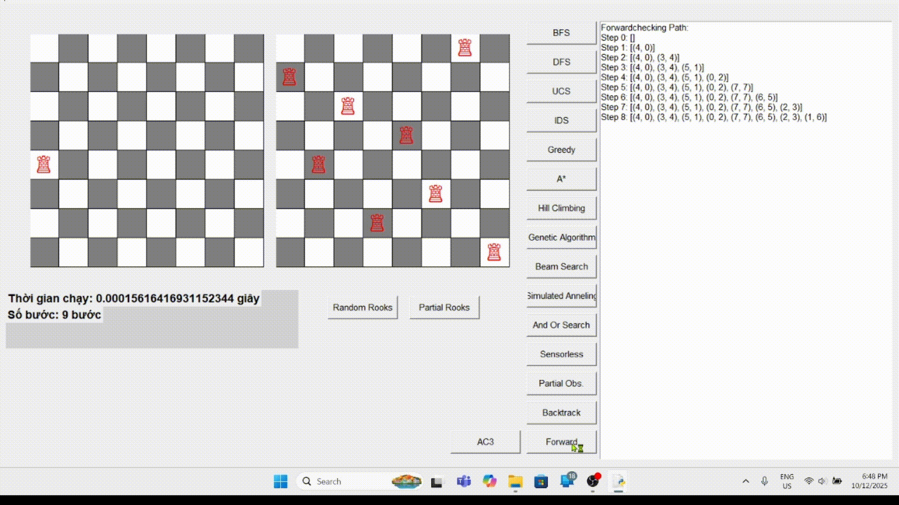

        Sau mỗi lần gán giá trị, loại bỏ trước các giá trị không hợp lệ cho các biến còn lại.
        Ưu điểm: Phát hiện xung đột sớm, giảm số lần quay lui.
        Nhược điểm: Tốn bộ nhớ hơn Backtracking.
  
      2.6.3. Constraint Propagation (AC-3)
      
 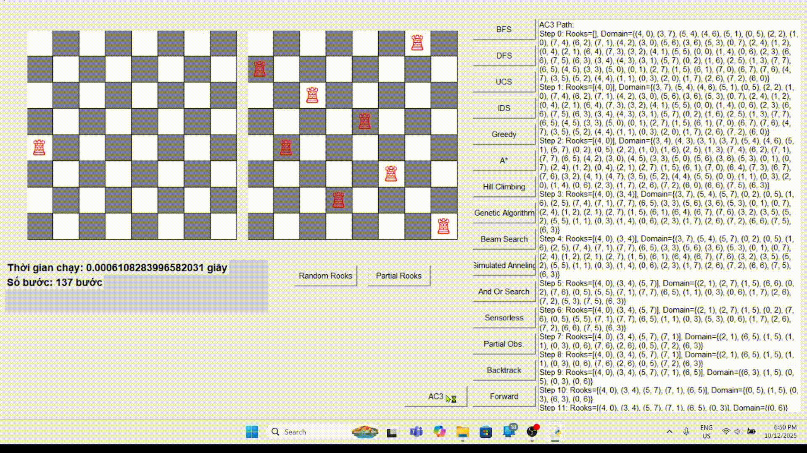

        Liên tục loại bỏ các giá trị không hợp lệ trong miền giá trị (domain) cho đến khi các ràng buộc nhất quán.
        Ưu điểm: Loại trừ được nhiều giá trị sai, giảm số lần tìm kiếm lại.
        Nhược điểm: Tốn bộ nhớ và không giải quyết được mọi mâu thuẫn phức tạp.
  
      2.6.4. So sánh hiệu suất
  
      - Biểu đồ thời gian thực thi.

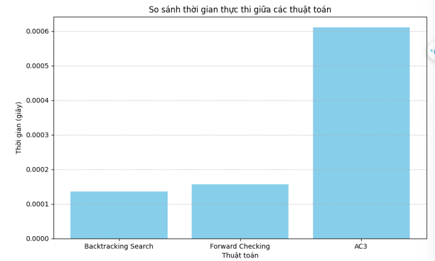

      
      - Biểu đồ số bước thực hiện.

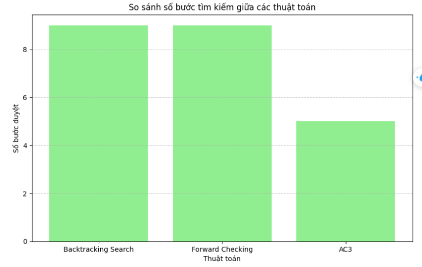

      - Biểu đồ hiệu quả theo công thức 1 / (Step × Time).

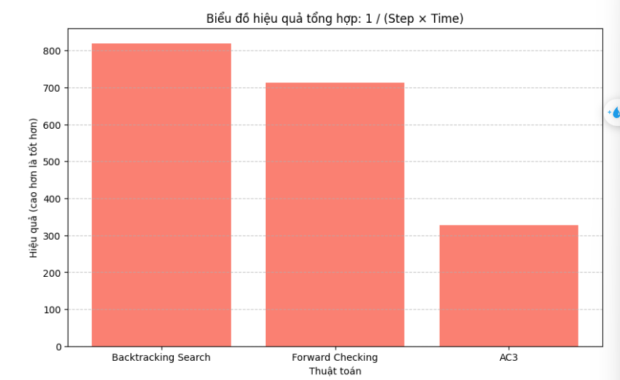

      
      
      
